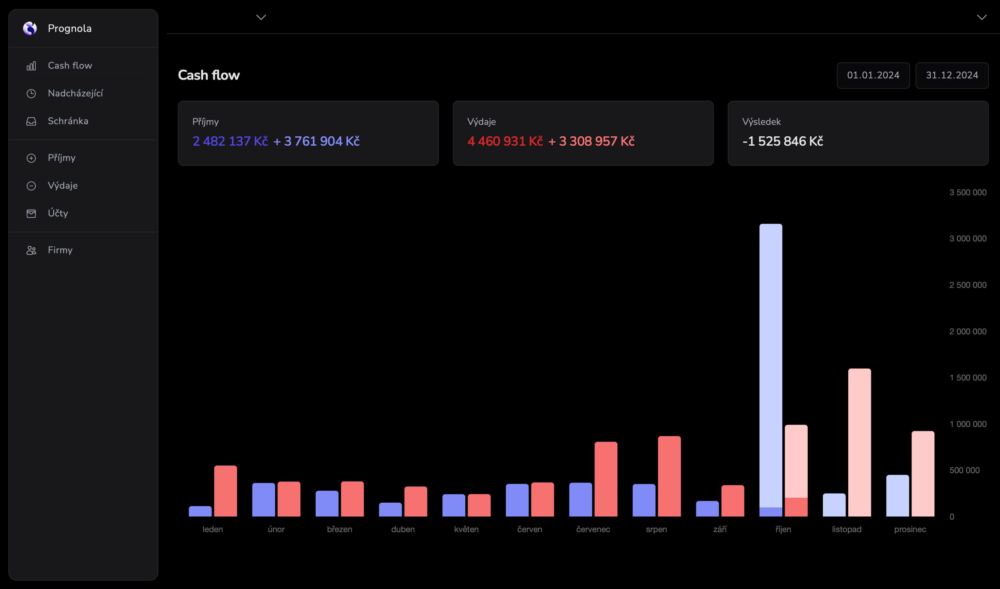

# What's Prognola?

**Prognola** is a financial app designed for organizations that want full control over their money. It helps you track income and expenses, plan your organization's budget, and gain insights into your financial health.

The project is currently in the **alpha version**, with the user interface translated into **Czech only** (English localization is coming soon). We are also preparing a [Docker Compose self-hosted installation](https://github.com/prague-digital-lab/prognola-self-hosted) for easy deployment.

---

## Key Features

### Scan Receipts and Invoices
Easily digitize your paper receipts and invoices for better tracking and record-keeping. Upload and categorize your documents, ensuring all your expenses are accounted for.

### Expense Management
Prognola helps you categorize and manage all your expenses in one place, providing a clear overview of where your money is going. Use filters, tags, and detailed reports to analyze spending patterns.

### Sync Bank Transactions
Synchronize your organization's bank accounts with Prognola to manage transactions effortlessly and view current account balances in real time.

---

## Supported Banks

Prognola currently supports the following banks:

- **Moneta (Czech Republic)** - Automatic API synchronization.
- **Fio Banka (Czech Republic)** - Automatic API synchronization.
- **Komerční banka (Czech Republic)** - Manual CSV import (API synchronization is planned for future updates).

---

## Planned Features
- **English Localization:** Making Prognola accessible to a global audience.
- **Advanced Reporting:** Comprehensive insights into income, expenses, and cash flow trends.
- **Self-Hosted Installation:** Docker Compose setup for organizations that prefer hosting their own data.

---

## Contributing
We welcome contributions from the community! Feel free to:
- Report bugs or suggest features via [GitHub Issues](https://github.com/prague-digital-lab/prognola/issues).
- Submit pull requests to improve the app or documentation.

---

## Getting Started
To try Prognola, visit our [landing page](https://prognola.com) and create an account. Installation guides and further documentation can be found in the [Wiki section](https://github.com/prague-digital-lab/prognola/wiki).

---

## License
Prognola is released under the [MIT License](LICENSE).